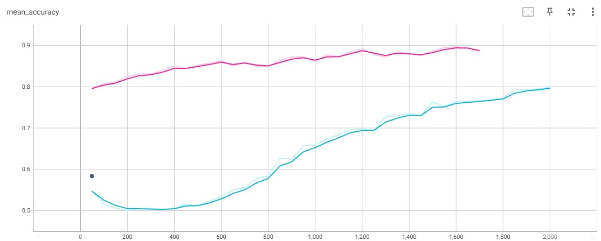
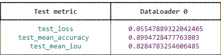

# Lane-segmentation-using-Segformer-semantic-segmentation

## Introduction:
The SegWeld GitHub repository embodies a pioneering effort in semantic segmentation, targeting the discernment of welding areas within X-ray images of battery plates. This task holds paramount importance in ensuring the structural integrity and reliability of battery components. Our work is rooted in a curated dataset consisting of 179 X-ray images, meticulously categorized into training, testing, and validation subsets. The dataset is expertly labeled and annotated on the Roboflow platform, facilitating a comprehensive understanding of welding patterns. Employing the SegFormer semantic segmentation model, we embark on an 84-epoch journey to extract meaningful spatial information from the X-ray images. Our objective is to create an accurate and robust model capable of identifying welding regions with exceptional precision, ultimately contributing to the optimization of battery production processes and quality control measures.

   

## Results:
The application of the SegFormer model yields impressive results, underscoring its efficacy in welding region segmentation. The testing phase demonstrates a minimal testing loss of 0.055, indicating the model's ability to accurately predict welding boundaries. Furthermore, our model attains a notable test mean accuracy of 89.94, reflecting its proficiency in correctly classifying welding regions within the X-ray images. The segmentation quality is further substantiated by a substantial test mean IOU score of 82.84, illustrating the model's capacity to accurately delineate complex boundaries. Visual representations of testing and training accuracy provide a clear trajectory of the model's learning process, showcasing the gradual convergence towards optimal performance. These results collectively highlight the potential of the SegFormer semantic segmentation model in revolutionizing the automated inspection and quality control of welding areas in battery plates.

    

## Summary
The SegWeld GitHub project introduces an innovative approach to semantic segmentation for accurately identifying welding regions within X-ray images of battery plates. The project leverages a meticulously curated dataset of 179 self-generated X-ray images, divided into training, testing, and validation subsets. Through the application of the SegFormer semantic segmentation model over 84 epochs, the project achieves remarkable results. The testing phase yields a testing loss of 0.055, a test mean accuracy of 89.94, and a substantial test mean IOU of 82.84, showcasing the model's prowess in precise boundary delineation. Visual representations of testing and training accuracy provide insights into the model's learning trajectory. This endeavor marks a significant advancement in automating the inspection of welding regions, with potential implications for enhancing battery manufacturing quality control processes.

